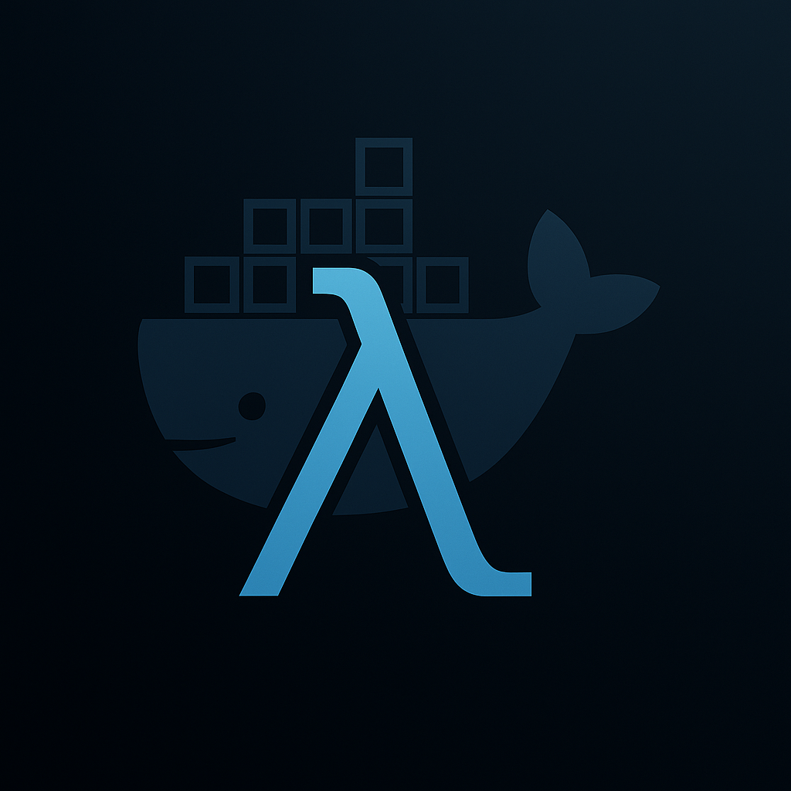

# 🚀 PyExecutorHub - The Ultimate Python Execution Platform

<p align="center">
  
</p>

```
             _____       ______                     _             _    _       _     
            |  __ \     |  ____|                   | |           | |  | |     | |    
            | |__) |   _| |__  __  _____  ___ _   _| |_ ___  _ __| |__| |_   _| |__  
            |  ___/ | | |  __| \ \/ / _ \/ __| | | | __/ _ \| '__|  __  | | | | '_ \ 
            | |   | |_| | |____ >  <  __/ (__| |_| | || (_) | |  | |  | | |_| | |_) |
            |_|    \__, |______/_/\_\___|\___|\__,_|\__\___/|_|  |_|  |_|\__,_|_.__/ 
                    __/ |                                                            
                    |___/              
```

> **IMPORTANT:**
> 
> **PyExecutorHub is designed exclusively for Python scripts and bots. Scripts and bots should NOT contain graphical libraries or GUI dependencies** (e.g., `tkinter`, `PyQt`, `matplotlib.pyplot`, `wxPython`, `PySide`, etc.). The serverless environment is designed for background execution without access to a graphical environment. If your script/bot imports any of these libraries, it will fail in production.

---

Transform your **Python scripts and bots** into scalable, secure, and lightning-fast serverless applications. PyExecutorHub provides enterprise-grade execution infrastructure with zero server management, **exclusively designed for Python development**.

**Python Version:** This system is designed for Python 3.11, but can be adjusted by modifying the Dockerfile.

## 🚀 Quick Installation

```bash
# Clone the repository
git clone https://github.com/simetb/PyExcutorHub.git
cd PyExcutorHub

# Run the installer
./install.sh
```

The installer will:
- ✅ Check system requirements (Docker, Docker Compose, Git, curl)
- ✅ Configure environment automatically
- ✅ Build and start all services
- ✅ Test the installation
- ✅ Show usage instructions

## 🏗️ Architecture

```
┌─────────────────┐    ┌─────────────────┐    ┌─────────────────┐
│   HTTP Client   │───▶│   FastAPI API   │───▶│  Docker Engine  │
│                 │    │   (API_PORT)    │                 │
└─────────────────┘    └─────────────────┘    └─────────────────┘
                              │                        │
                              ▼                        ▼
                       ┌─────────────────┐    ┌─────────────────┐
                       │   Config YAML   │    │  Isolated       │
                       │   (Programs)    │    │  Containers     │
                       └─────────────────┘    └─────────────────┘
```

- **REST API**: FastAPI exposes endpoints to execute and monitor Python scripts/bots.
- **Isolation**: Each execution occurs in an independent Docker container.
- **Configuration**: Programs are defined in `config.yaml`.
- **Python-Focused**: Designed exclusively for Python scripts and bots.
- **No GUI dependencies**: Console-only Python scripts/bots.

## 🚀 Installation and Configuration

### 1. Clone the repository
```bash
git clone <repository-url>
cd PyExecutorHub
```

### 2. Configure environment variables
```bash
cp env.example .env
# Edit .env with your configurations
# Especially HOST_PROJECT_DIR and API_PORT
```

### 3. Build and run with Docker Compose
```bash
docker compose up -d --build
```

### 4. Verify installation
```bash
# Get the configured port
API_PORT=$(grep API_PORT .env | cut -d'=' -f2)
curl http://localhost:$API_PORT/health
```

## 📋 Program Configuration

### Directory structure
```
PyExecutorHub/
├── scripts/
│   └── example_script/
│       ├── main.py
│       ├── requirements.txt
│       └── .env
├── bots/
│   └── example_bot/
│       ├── run.py
│       ├── requirements.txt
│       └── .env
└── config.yaml
```

### Script example

**scripts/example_script/main.py**
```python
#!/usr/bin/env python3
import os, sys
from datetime import datetime

def main():
    print("🚀 Script running...")
    print(f"Date and time: {datetime.now()}")
    print(f"Python version: {sys.version}")
    print(f"Working directory: {os.getcwd()}")
    # Your logic here
    print("✅ Script completed successfully!")

if __name__ == "__main__":
    main()
```

**scripts/example_script/requirements.txt**
```txt
requests==2.31.0
python-dotenv==1.0.0
```

**scripts/example_script/env.example**
```env
# Environment variables for the example script
DEBUG=false
```

### Bot example

**bots/example_bot/run.py**
```python
#!/usr/bin/env python3
import os, sys
from datetime import datetime

def main():
    print("🤖 Bot running...")
    print(f"Date and time: {datetime.now()}")
    print(f"Python version: {sys.version}")
    print(f"Working directory: {os.getcwd()}")
    # Bot logic here
    print("✅ Bot completed successfully!")

if __name__ == "__main__":
    main()
```

**bots/example_bot/requirements.txt**
```txt
requests==2.31.0
python-dotenv==1.0.0
```

**bots/example_bot/env.example**
```env
# Environment variables for the example bot
DEBUG=false
```

### Configuration example in config.yaml
```yaml
scripts:
  example_script:
    id: "example_script"
    name: "Example Script"
    path: "scripts/example_script"
    description: "Example script for production"
    enabled: true
    main_file: "main.py"

bots:
  example_bot:
    id: "example_bot"
    name: "Example Bot"
    path: "bots/example_bot"
    description: "Example bot for production"
    enabled: true
    main_file: "run.py"

settings:
  docker_image: "serverless-base"
  timeout_seconds: 300
  max_concurrent_executions: 5
  memory_limit: "1g"  # Recommended: 1GB for most cases
  cpu_limit: "0.5"
```

## 🔧 Actions System (Hooks)

The system includes an actions mechanism that runs automatically **before** and **after** each Python program.

### 📁 Actions Structure
```
actions/
├── act_before.py      # Actions BEFORE the program
├── act_after.py       # Actions AFTER the program
├── requirements.txt   # Dependencies for actions
└── README.md         # Detailed documentation
```

### 🔄 Execution Flow
```
1. Execution request received
2. Docker container created
3. 🔧 act_before.py runs (validations, logging)
4. 🚀 Main Python program executes
5. 🔧 act_after.py runs (notifications, cleanup)
6. Result returned
```

### 📋 Variables Available in Actions
- `PROGRAM_ID`: ID of the Python program being executed
- `EXECUTION_ID`: Unique execution ID
- `EXIT_CODE`: Exit code (only in act_after.py)
- `PARAM_*`: Parameters passed to the Python program

### 🚀 Use Cases
- ✅ **Environment validations** (disk space, connectivity)
- ✅ **Logging and monitoring** (start, end, metrics)
- ✅ **Notifications** (success, error, alerts)
- ✅ **Resource cleanup** (temporary files)
- ✅ **Result backup** (important files)
- ✅ **Log analysis** (errors, performance)

**📖 See complete documentation:** [actions/README.md](actions/README.md)

## 🔌 API Endpoints

### POST /execute - Execute a Python Program

**Description:** Executes a Python program (script or bot) in an isolated Docker container.

**URL:** `POST http://localhost:API_PORT/execute`

**Headers:**
```
Content-Type: application/json
```

**Body (JSON):**
```json
{
  "program_id": "string",           // REQUIRED: ID of the Python program to execute
  "parameters": {                   // OPTIONAL: Additional parameters
    "parameter1": "value1",
    "parameter2": "value2"
  }
}
```

**Usage Examples:**

1. **Execute example Python script:**
```bash
curl -X POST http://localhost:API_PORT/execute \
  -H "Content-Type: application/json" \
  -d '{"program_id": "example_script"}'
```

2. **Execute example Python bot:**
```bash
curl -X POST http://localhost:API_PORT/execute \
  -H "Content-Type: application/json" \
  -d '{"program_id": "example_bot"}'
```

3. **Execute Vodafone bot (using ID "6"):**
```bash
curl -X POST http://localhost:API_PORT/execute \
  -H "Content-Type: application/json" \
  -d '{"program_id": "6"}'
```

4. **With additional parameters:**
```bash
curl -X POST http://localhost:API_PORT/execute \
  -H "Content-Type: application/json" \
  -d '{
    "program_id": "6",
    "parameters": {
      "user": "admin@example.com",
      "wait_time": "30"
    }
  }'
```

**Successful Response (200):**
```json
{
  "execution_id": "uuid-string",
  "program_id": "6",
  "status": "queued",
  "message": "Program '6' queued for execution",
  "timestamp": "2025-07-02T09:10:00.000000"
}
```

**Error Responses:**

404 - Python program not found:
```json
{
  "detail": "Program with ID 'nonexistent_program' not found"
}
```

400 - Python program disabled:
```json
{
  "detail": "Program '6' is disabled"
}
```

**Important Notes:**
- **Asynchronous Execution:** The request returns immediately with an `execution_id`
- **Execution Status:** Use the `execution_id` to query status at `/executions/{execution_id}`
- **Parameters:** Passed as environment variables to the container with `PARAM_` prefix
- **Timeout:** Default 300 seconds (5 minutes)
- **Isolation:** Each Python execution runs in a separate Docker container

### Other Endpoints

- `GET /programs` - List available Python programs
- `GET /executions` - List executions
- `GET /executions/{execution_id}` - Execution status
- `GET /executions/stats` - Statistics
- `GET /health` - System health

## 🛡️ Security

- API access should be restricted by VPN/firewall.
- No need to use API keys or JWT if the network is secure.
- Containers run with non-root user
- Network isolation
- Configured resource limits
- Docker socket with restricted permissions

## 📊 Monitoring and Maintenance

- View logs: `docker compose logs -f serverless-api`
- Clean old executions: `curl -X DELETE http://localhost:$API_PORT/executions/cleanup`
- Restart service: `docker compose restart serverless-api`
- Configuration backup: `cp config.yaml config.yaml.backup.$(date +%Y%m%d)`

## 🚨 Troubleshooting

- **Don't use GUI libraries**: If your Python script/bot imports `tkinter`, `PyQt`, `matplotlib.pyplot`, etc., it will fail.
- **API not responding**: Check status with `docker compose ps` and logs.
- **Executions failing**: Check Python dependencies and configuration.
- **Resource problems**: Use `docker stats` and clean resources with `docker system prune -f`.
- **Port occupied**: Change `API_PORT` in the `.env` file if the default port is in use.

## 📚 Documentation

- All relevant information is in this README.
- For support, contact the DevOps team.

---

**⚡ Deploy Python scripts in seconds, not hours. Execute with confidence.** 